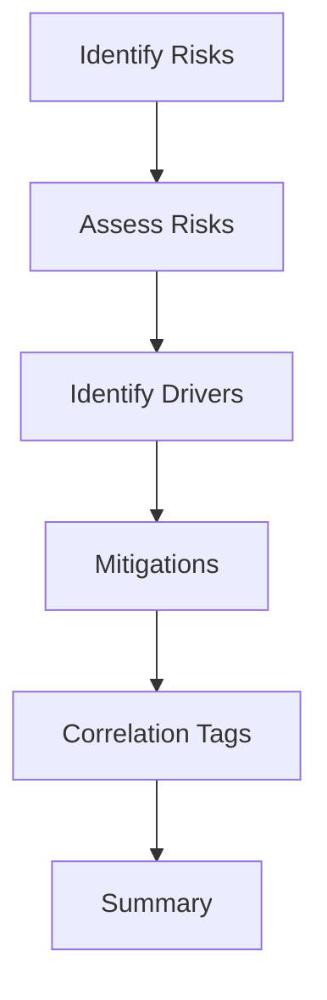

# Prepare Presentation Output

The `prepare_presentation_output` workflow orchestrates existing chains with
[LangGraph](https://github.com/langchain-ai/langgraph) to create a structured
summary for slides or workshops. Output formatting differs per audience as
described in [Audience Output Matrix](audience_output.md).

## Usage

```python
from src.workflows import prepare_presentation_output
from src.models.schemas import PresentationRequest, AudienceEnum

req = PresentationRequest(
    project_id="p42",
    project_description="Introduce a new CRM system",
    audience=AudienceEnum.executive,
    focus_areas=["Technical"],
)
result = prepare_presentation_output(req)
print(result.executive_summary)
```

## Workflow



## Example Output

```
Executive summary: <text>
Main risks: ["Data loss", "Downtime"]
Quantitative summary: Data loss: P=0.1, I=10000
...
```

